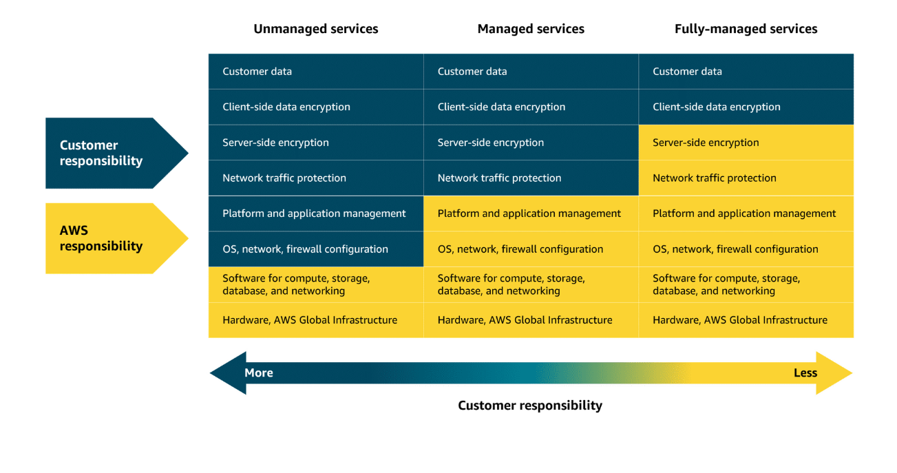
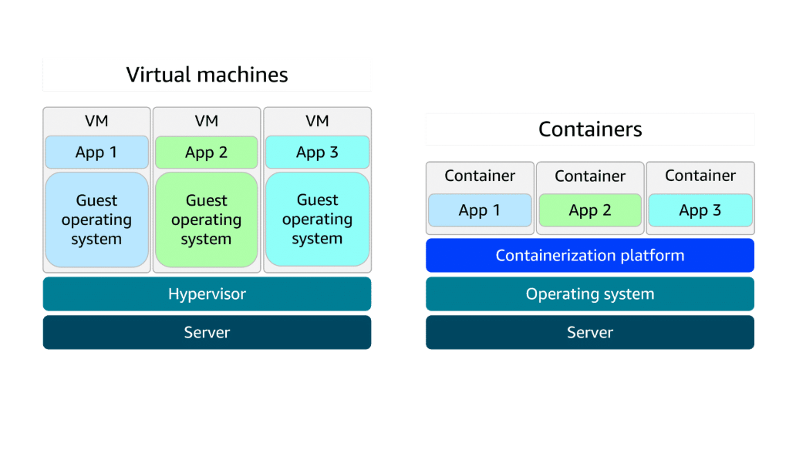
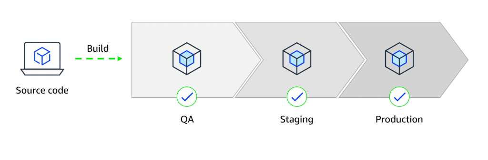
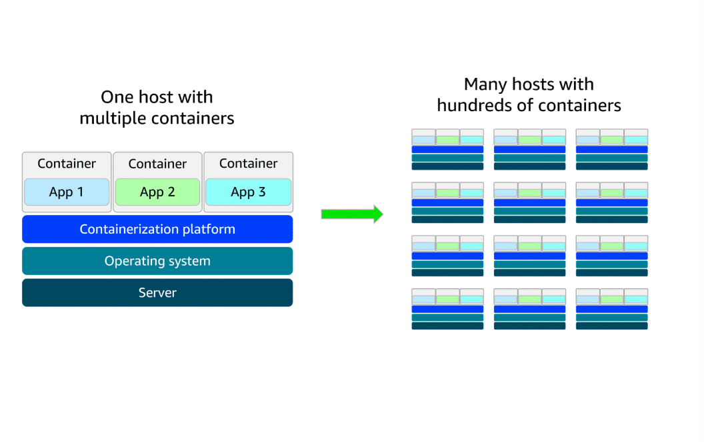
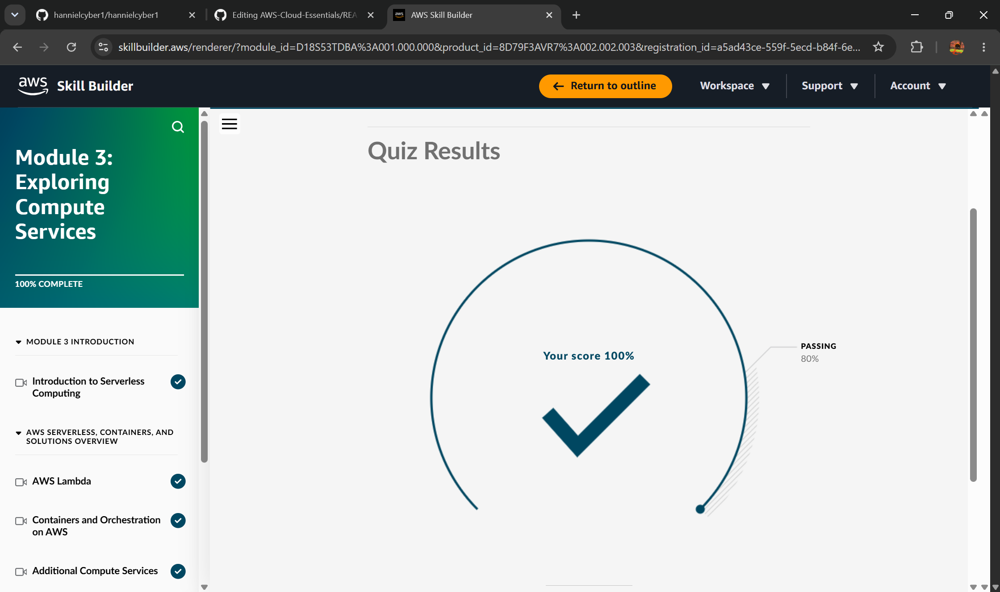

# ☁️ AWS Cloud Essentials

<p align="center">
  
  
  
</p>

## 📖 Overview

This repository contains my notes, labs, and learning outcomes from studying **Amazon Web Services (AWS) Cloud Essentials**.

The goal of this repository is to document my progress in cloud computing while building a strong understanding of AWS core concepts, cloud architecture, security, and global infrastructure.This repository serves as my personal cloud computing knowledge base and portfolio, documenting my hands-on AWS learning journey through notes, labs, projects, and practical exercises.

---


# Module 1️⃣


## 🎯 Learning Objectives

Through this module, I learned how to:

* Understand Cloud Computing fundamentals
* Explore AWS Global Infrastructure
* Differentiate Regions and Availability Zones
* Understand High Availability and Fault Tolerance
* Learn the AWS Shared Responsibility Model
* Apply cloud concepts to real-world business scenarios

---

## 🌎 AWS Global Infrastructure

AWS operates one of the largest cloud infrastructures in the world.

### AWS Regions

AWS Regions are geographically separated locations where AWS operates data centers.

Examples include:

* US East (N. Virginia)
* Europe (Ireland)
* Asia Pacific (Singapore)

Organizations deploy resources in Regions closest to their users to reduce latency and improve performance.

---

### Availability Zones (AZs)

Each AWS Region contains multiple Availability Zones.

Availability Zones are:

* Physically separated
* Independently powered
* Independently networked
* Designed for fault isolation

Using multiple Availability Zones increases application reliability and resilience.

---

## 🔄 High Availability & Fault Tolerance

AWS infrastructure is designed to provide:

### High Availability

Applications remain accessible even if part of the infrastructure experiences issues.

### Fault Tolerance

Services continue operating despite hardware failures or outages.

### Best Practice

Deploy resources across multiple Availability Zones to ensure redundancy and minimize downtime.

---

## 🔐 AWS Shared Responsibility Model

Security in AWS follows a **Shared Responsibility Model**.

### AWS Responsibilities

AWS is responsible for:

* Physical security
* Data centers
* Hardware infrastructure
* Networking infrastructure
* Global cloud services

### Customer Responsibilities

Customers are responsible for:

* Data security
* Identity and access management
* Account permissions
* Client-side encryption
* Security configurations

### Shared Responsibilities

Depending on the AWS service used, some responsibilities are shared between AWS and the customer.

Examples include:

* Network traffic protection
* Server-side encryption
* Operating system configuration
* Application security


---

## 🏢 Real-World Use Case

### Global Ecommerce Expansion

A company based in Seattle wanted to expand its services internationally.

### Challenge

Hosting infrastructure in a single location increased latency for customers in Europe and Asia.

### Solution

The company deployed resources to multiple AWS Regions:

#### 🇮🇪 Ireland Region

Benefits:

* Improved availability
* Reduced latency for European customers
* Increased fault tolerance through multiple Availability Zones

#### 🇸🇬 Singapore Region

Benefits:

* Faster access for Asian customers
* Improved user experience
* Reduced response times

### Result

Using AWS allowed the company to expand globally within minutes instead of spending months or years building physical infrastructure.

---

## 🧠 Key Takeaways

* AWS provides a globally distributed cloud platform.
* Availability Zones improve reliability and uptime.
* Multi-region deployments reduce latency.
* Security is a shared responsibility between AWS and customers.
* Cloud computing enables rapid global scalability.

---
## Quiz Score


## 📚 Course Progress

| Module   | Topic                 | Status      |
| -------- | --------------------- | ----------- |
| Module 1 | AWS Cloud Essentials | ✅ Completed |

---

#  Module 2️⃣ : Compute, Scaling & Application Integration


---


## 🎯 Learning Objectives

By completing this module, I learned how to:

* Understand cloud compute resources and Amazon EC2
* Compare AWS compute resources with traditional on-premises infrastructure
* Identify and select appropriate EC2 instance families
* Understand Amazon EC2 pricing models
* Use Amazon Machine Images (AMIs)
* Differentiate scalability from elasticity
* Configure Auto Scaling concepts
* Understand Elastic Load Balancing (ELB)
* Explore event-driven architectures
* Understand Amazon SQS, Amazon SNS, and Amazon EventBridge
* Recognize modern cloud application design patterns

---

## 🖥️ Amazon EC2 (Elastic Compute Cloud)

Amazon EC2 provides scalable virtual servers in the cloud. It enables organizations to deploy applications without purchasing, maintaining, or managing physical hardware.

With EC2, resources can be launched, configured, scaled, and terminated on demand.

### Key Benefits

✅ On-demand compute resources

✅ Rapid deployment

✅ Flexible scaling

✅ Global availability

✅ Pay-as-you-go pricing

✅ Reduced infrastructure costs

---

### Traditional Infrastructure vs AWS EC2

| Traditional Infrastructure    | AWS EC2                    |
| ----------------------------- | -------------------------- |
| Purchase physical servers     | Launch instances on demand |
| Weeks or months to deploy     | Minutes to deploy          |
| High upfront costs            | Pay only for usage         |
| Manual scaling                | Automated scaling          |
| Hardware maintenance required | Managed by AWS             |

---

## ⚙️ EC2 Instance Types

AWS offers specialized instance families optimized for different workloads.

| Instance Family       | Description                              | Common Use Cases                        |
| --------------------- | ---------------------------------------- | --------------------------------------- |
| General Purpose       | Balanced compute, memory, and networking | Web servers, applications, repositories |
| Compute Optimized     | High-performance processors              | HPC, gaming servers, ML inference       |
| Memory Optimized      | Large memory capacity                    | Databases, analytics, caching           |
| Accelerated Computing | GPUs and hardware accelerators           | AI/ML, rendering, graphics              |
| Storage Optimized     | High-speed local storage                 | Data warehousing, big data workloads    |

---

## 🛠️ Managing AWS Resources

AWS services are accessed through APIs and can be managed using several interfaces.

### AWS Management Console

A web-based graphical interface for AWS services.

#### Best For

* Beginners
* Learning AWS
* Manual resource management

---

### AWS Command Line Interface (CLI)

A command-line tool used to manage AWS resources.

#### Benefits

* Automation
* Scripting
* Faster administration
* Infrastructure management

Example:

```bash
aws ec2 describe-instances
```

---

### AWS Software Development Kits (SDKs)

SDKs allow developers to integrate AWS services directly into applications.

#### Supported Languages

* Python
* Java
* JavaScript
* C#
* Go
* PHP

---

## 🔐 EC2 & the Shared Responsibility Model

Amazon EC2 follows the AWS Shared Responsibility Model.

### AWS Responsibility (Security *of* the Cloud)

AWS manages:

* Physical security
* Data centers
* Networking infrastructure
* Hardware maintenance
* Global cloud infrastructure

### Customer Responsibility (Security *in* the Cloud)

Customers manage:

* Operating systems
* Security patches
* User access control
* Security groups
* Firewall rules
* Application security

---

## 📦 Amazon Machine Images (AMIs)

An Amazon Machine Image (AMI) is a preconfigured template used to launch EC2 instances.

### Components of an AMI

* Operating System
* Application software
* Storage configuration
* Architecture settings
* Launch permissions

---

### Types of AMIs

#### AWS Managed AMIs

Provided and maintained by AWS.

#### Marketplace AMIs

Created by third-party vendors and available through AWS Marketplace.

#### Custom AMIs

Created and maintained by users for specific organizational requirements.

---

#### Benefits of AMIs

✅ Faster deployments

✅ Consistent configurations

✅ Reduced setup errors

✅ Easier scaling

✅ Standardized environments

---

## 💰 Amazon EC2 Pricing Models

AWS offers multiple pricing options to optimize costs.

| Pricing Model       | Description                                 |
| ------------------- | ------------------------------------------- |
| On-Demand           | Pay only for resources used                 |
| Reserved Instances  | Up to 75% savings for predictable workloads |
| Savings Plans       | Flexible long-term pricing commitments      |
| Spot Instances      | Up to 90% savings using spare AWS capacity  |
| Dedicated Hosts     | Entire physical server reserved             |
| Dedicated Instances | Hardware isolated to a single account       |

---

## 📈 Scalability vs Elasticity

Although related, scalability and elasticity are different concepts.

### Scalability

The ability of a system to increase resources to handle growth.

#### Vertical Scaling (Scale Up)

Increase the power of existing resources.

```text
2 vCPU → 8 vCPU
4 GB RAM → 32 GB RAM
```

#### Horizontal Scaling (Scale Out)

Add additional servers.

```text
1 Server → 5 Servers
```

---


---

## Elasticity

The ability to automatically adjust resources based on demand.

#### Example

```text
High Traffic → Add Resources
Low Traffic → Remove Resources
```

#### Benefits

* Better performance
* Lower operational costs
* Efficient resource utilization
* Automatic resource adjustment

---

## 🔄 Amazon EC2 Auto Scaling

Amazon EC2 Auto Scaling automatically adjusts the number of EC2 instances based on application demand.

### Scaling Methods

#### Dynamic Scaling

Automatically responds to real-time demand changes.

#### Predictive Scaling

Forecasts future traffic and provisions resources before demand increases.

---

## Auto Scaling Group Settings

| Setting          | Purpose                             |
| ---------------- | ----------------------------------- |
| Minimum Capacity | Lowest number of running instances  |
| Desired Capacity | Target number of instances          |
| Maximum Capacity | Highest number of instances allowed |

---
### Minimum Capicity 


### Maximum Capacity 


---

#### Benefits

✅ High availability

✅ Cost optimization

✅ Improved performance

✅ Reduced operational effort

---

## ⚖️ Elastic Load Balancing (ELB)

Elastic Load Balancing distributes incoming traffic across multiple EC2 instances.

#### Without ELB

```text
Users → Single Server
```

#### With ELB

```text
Users → Load Balancer → Multiple Servers
```

---

#### Benefits

✅ Efficient traffic distribution

✅ High availability

✅ Fault tolerance

✅ Better performance

✅ Simplified scaling

---

#### Common Load Balancing Algorithms

| Method              | Description                         |
| ------------------- | ----------------------------------- |
| Round Robin         | Traffic distributed evenly          |
| Least Connections   | Routes to least busy server         |
| IP Hash             | Routes based on client IP           |
| Least Response Time | Routes to fastest responding server |

---

## 🏗️ Application Architecture Patterns

### Monolithic Architecture

All application components are tightly coupled within a single application.

#### Challenges

* Difficult scaling
* Single point of failure
* Slower deployments
* Reduced flexibility

---

### Microservices Architecture

Application components operate independently and communicate through APIs or events.

#### Benefits

* Independent scaling
* Better fault isolation
* Faster deployments
* Improved resilience
* Easier maintenance

---

## 📡 Amazon EventBridge

Amazon EventBridge is a serverless event bus service that enables event-driven architectures.

Applications can communicate through events without being tightly coupled.

### Example: Food Delivery Application

1. Customer places an order
2. Payment service processes payment
3. Restaurant receives notification
4. Inventory is verified
5. Driver receives delivery request

All actions are triggered automatically through events.

---

## 📨 Amazon SQS (Simple Queue Service)

Amazon SQS is a fully managed message queue service that enables reliable communication between distributed application components.

#### Benefits

* Reliable message delivery
* Decoupled applications
* Fault tolerance
* High scalability
* Message persistence

##### Example

Customer support tickets enter a queue and are processed when agents become available.

---

## 📢 Amazon SNS (Simple Notification Service)

Amazon SNS is a publish-subscribe messaging service used for notifications.

#### Features

* Email notifications
* SMS notifications
* Mobile push notifications
* Multiple subscribers
* Topic-based messaging

##### Example

Subscribers receive notifications for:

* New products
* Promotions
* Security alerts
* Company announcements

Only users subscribed to a topic receive its messages.

---

Quiz score


# 📚 Course Progress

| Module   | Topic                                      | Status      |
| -------- | ------------------------------------------ | ----------- |
| Module 1 | AWS Cloud Foundations                      | ✅ Completed |
| Module 2 | Compute, Scaling & Application Integration | ✅ Completed |

---


#  Module 3️⃣: Serverless Computing & Container Services


---

## 📖 Overview

Module 3 introduces modern cloud-native computing models, focusing on **serverless computing**, **AWS Lambda**, **containers**, and AWS container management services.
---

## 🎯 Learning Objectives

After completing this module, I can:

- Explain the differences between unmanaged, managed, and fully managed services
- Understand serverless computing concepts
- Describe how AWS Lambda works
- Identify common AWS Lambda use cases
- Compare containers and virtual machines
- Understand container orchestration
- Explain Amazon ECS, Amazon ECR, and AWS Fargate
- Identify use cases for Elastic Beanstalk, AWS Batch, Lightsail, and Outposts
- Recognize when to use serverless or container-based solutions

---

## 🏗 Understanding Compute Service Models

AWS provides multiple levels of infrastructure management depending on organizational needs.

### Unmanaged Services

With unmanaged services such as Amazon EC2:

#### AWS Manages

- Physical servers
- Networking infrastructure
- Data centers
- Hardware maintenance

#### Customer Manages

- Operating systems
- Security patches
- Network configuration
- Applications
- Monitoring

This model provides maximum flexibility but requires greater administrative effort.

---

### Managed Services

Managed services reduce operational responsibilities by allowing AWS to handle portions of the infrastructure management process.

#### Benefits

- Reduced maintenance
- Simplified deployment
- Easier scaling
- Lower operational overhead

Organizations can focus more on application development and less on infrastructure management.

---

### Fully Managed Services

Fully managed services abstract infrastructure entirely.

#### Characteristics

✅ No server management

✅ Automatic scaling

✅ Built-in availability

✅ Reduced operational complexity

AWS manages the underlying infrastructure while customers focus primarily on application code and business logic.




---

## ⚡ Introduction to Serverless Computing

Serverless computing allows developers to build and run applications without provisioning or managing servers.

Despite the name "serverless," servers still exist; however, AWS manages them completely behind the scenes.

#### Benefits

- No server administration
- Automatic scaling
- High availability
- Pay-per-use pricing
- Faster application development

Serverless architectures are ideal for event-driven workloads and applications with unpredictable traffic patterns.

---

## 🚀 AWS Lambda

AWS Lambda is a serverless compute service that executes code in response to events.

Developers upload code as functions, and AWS automatically handles:

- Infrastructure management
- Scaling
- Resource allocation
- Availability
- Execution environments

Lambda only runs when triggered and charges only for actual compute time consumed.

---

### How AWS Lambda Works

#### Step 1: Upload Function Code

Developers upload application code to Lambda as a function.

```text
Developer → Lambda Function
```

#### Step 2: Configure Event Triggers

Functions can be triggered by:

- Amazon S3 uploads
- API requests
- Database updates
- AWS service events
- User actions

```text
Event → Trigger → Lambda Function
```

#### Step 3: Execute Function

When an event occurs:

1. Lambda receives the event
2. AWS allocates resources
3. Function executes
4. Results are returned

```text
Event
   ↓
Lambda
   ↓
Execution
   ↓
Response
```

AWS automatically handles scaling and infrastructure throughout the process.

---

### AWS Lambda Pricing

Lambda follows a consumption-based pricing model.

You pay only for:

- Number of requests
- Compute time used
- Memory allocated

#### Benefits

- No idle server costs
- Cost-effective for variable workloads
- Fine-grained billing measured in milliseconds

---

## 🌍 Real-World AWS Lambda Use Cases

### 📸 Image Processing

A social media platform automatically processes uploaded images.

When a user uploads a photo:

- Resize image
- Apply filters
- Optimize storage

#### Why Lambda?

- Automatically scales
- Handles thousands of uploads
- No infrastructure management required

---

### 📰 Personalized News Recommendations

A news application uses Lambda to:

- Retrieve articles
- Process content
- Generate recommendations

#### Why Lambda?

- Executes only when users interact
- Scales automatically during peak traffic

---

### 🎮 Online Gaming Events

Gaming companies use Lambda to process:

- Player achievements
- Leaderboard updates
- Match statistics
- Real-time game events

#### Why Lambda?

- Handles massive event volumes
- Scales instantly
- Cost-effective during fluctuating usage

---

## 📦 Containers vs Virtual Machines
A container packages your application with everything it needs to run, so it works the same on any computer. This helps to move, update, and manage. Containers are faster and lighter than virtual machines (VMs) because they share the host computer’s operating system. VMs use a hypervisor to run full, separate operating systems, which makes them less resource-efficient and have longer startup times.

| Feature | Containers | Virtual Machines |
|----------|------------|------------------|
| Startup Time | Seconds | Minutes |
| Resource Usage | Lightweight | Heavy |
| Operating System | Shared Host OS | Full Guest OS |
| Portability | High | Moderate |
| Scalability | Excellent | Good |

Containers share the host operating system, making them faster and more resource-efficient than virtual machines.




---

### 🔄 Why Containers Matter

Containers package:

- Application code
- Libraries
- Dependencies
- Runtime environment

Into a single portable unit.

#### Benefits

✅ Consistent deployments

✅ Easier troubleshooting

✅ Improved portability

✅ Faster application delivery

Containers eliminate the classic:

> "It works on my machine."

problem by ensuring consistency across development, testing, and production environments.



---

## ⚙️ Container Orchestration

As applications grow, managing hundreds or thousands of containers manually becomes impractical.

Container orchestration automates:

- Deployment
- Scaling
- Health monitoring
- Recovery
- Resource allocation

This ensures containerized applications remain available and scalable.


---

## 🐳 Amazon Elastic Container Service (ECS)

Amazon ECS is AWS's container orchestration platform used to deploy and manage containerized applications.

#### Key Features

- Highly scalable
- Docker support
- Integrated with AWS services
- Simplified container management

---

### ECS Launch Types
---

### ECS on EC2

You manage the EC2 infrastructure.

#### Best For

- Custom networking
- Specialized hardware requirements
- Greater infrastructure control

### ECS with AWS Fargate

Serverless container deployment.

#### Best For

- Startups
- Small teams
- Variable workloads
- Reduced operational management

AWS handles the underlying infrastructure automatically.

---

## 📂 Amazon Elastic Container Registry (ECR)

Amazon ECR is AWS's managed container image registry.

#### Features

- Store container images
- Push and pull images
- Secure image management
- OCI-compliant support

ECR integrates seamlessly with ECS and EKS deployments.

---

## 🚀 AWS Fargate

AWS Fargate is a serverless compute engine for containers.

Unlike ECS or EKS, which orchestrate containers, Fargate provides the infrastructure required to run them.

#### Benefits

✅ No server management

✅ Automatic scaling

✅ Pay only for resources used

✅ Improved developer productivity

---

## 🌱 AWS Elastic Beanstalk

Elastic Beanstalk simplifies application deployment and management.

Developers upload code, and AWS automatically handles:

- Infrastructure provisioning
- Load balancing
- Auto Scaling
- Monitoring

#### Supported Platforms

- Java
- Python
- .NET
- Node.js
- Docker
- PHP

#### Best For

- Web applications
- REST APIs
- Backend services
- Microservices

---

## 📊 AWS Batch

AWS Batch is a managed service for executing batch-processing workloads.

#### Use Cases

- Scientific simulations
- Big data processing
- Machine learning training
- Financial analysis
- Media rendering

AWS automatically provisions compute resources and optimizes workload execution.

---

## 💡 Amazon Lightsail

Amazon Lightsail provides a simplified cloud experience with predictable monthly pricing.

#### Includes

- Virtual servers
- Databases
- Networking
- Storage

#### Best For

- Small businesses
- Blogs
- Personal websites
- Development environments

---

## 🏢 AWS Outposts

AWS Outposts extends AWS infrastructure into on-premises environments.

This provides a consistent AWS experience across:

- Cloud environments
- Corporate data centers
- Hybrid deployments

#### Best For

- Low-latency workloads
- Data residency requirements
- Legacy application modernization
- Hybrid cloud strategies

---

Quiz Score 




# 📚 Course Progress

| Module | Topic | Status |
|---------|--------|---------|
| Module 1 | AWS Cloud Foundations | ✅ Completed |
| Module 2 | Compute, Scaling & Application Integration | ✅ Completed |
| Module 3 | Serverless Computing & Container Services | ✅ Completed |


---

### ⭐ If you found this repository helpful, consider giving it a star!

